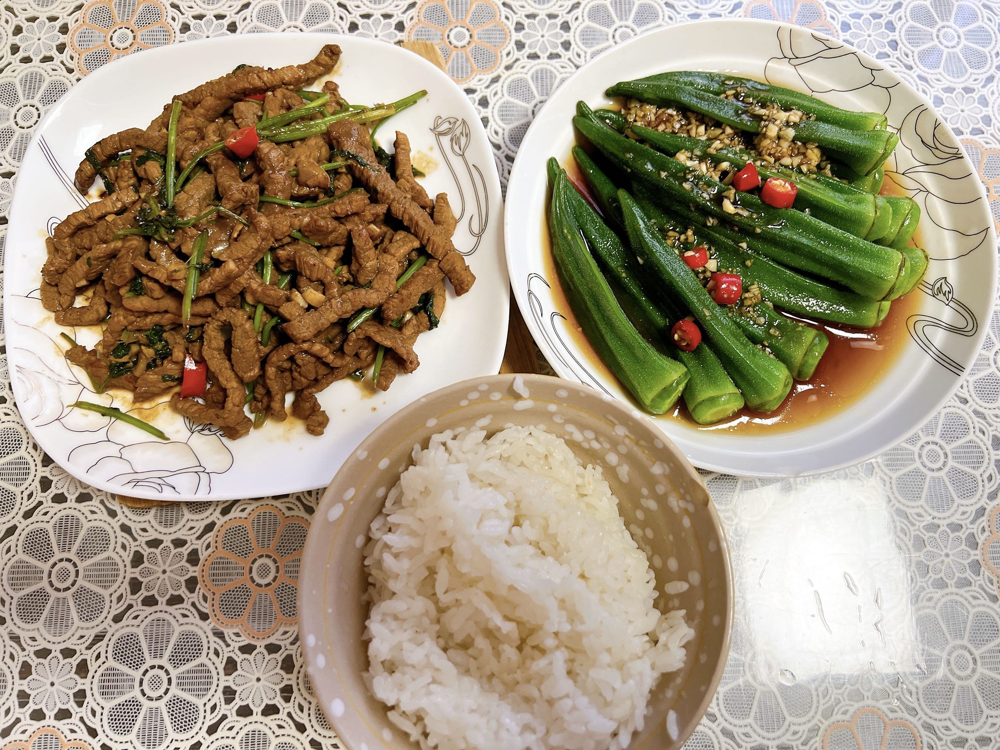
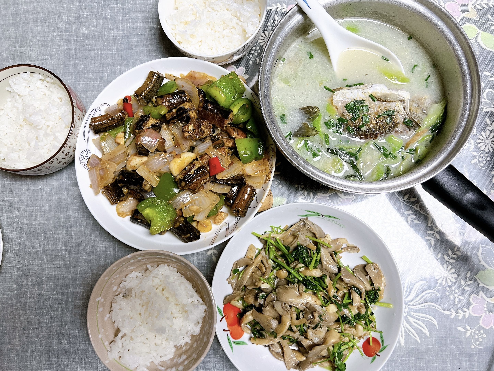
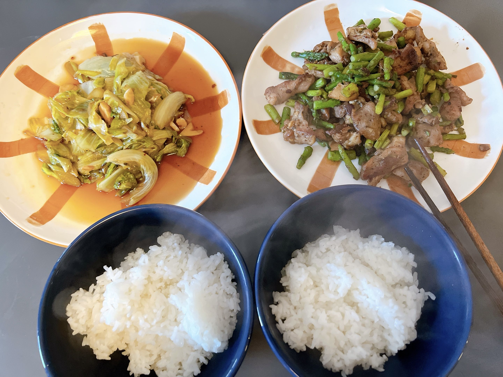
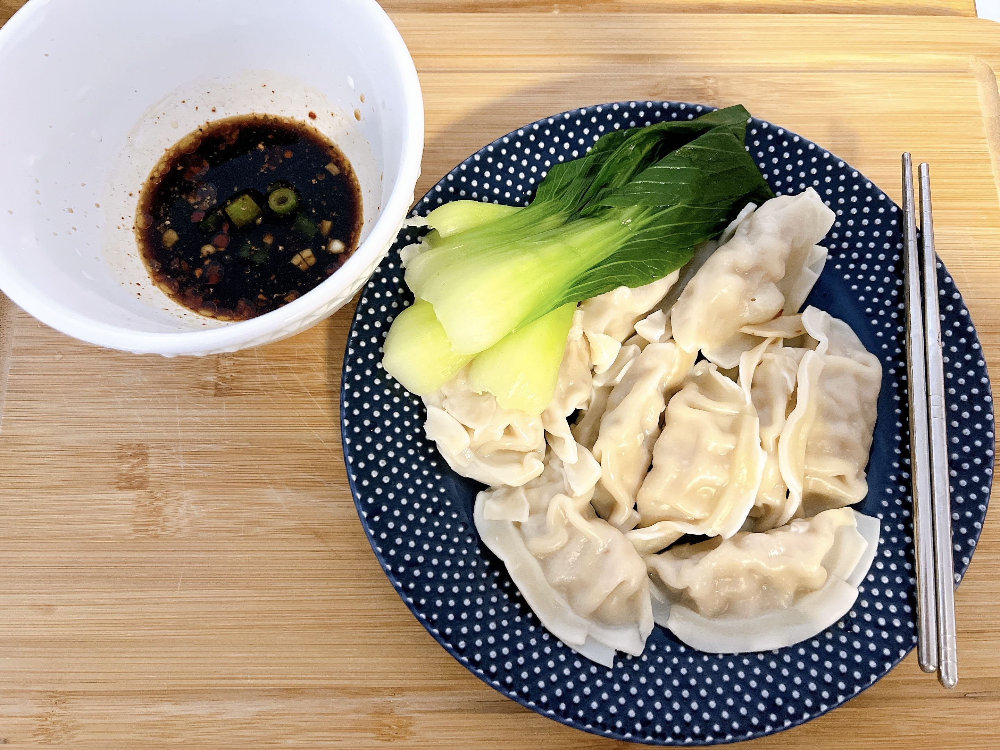
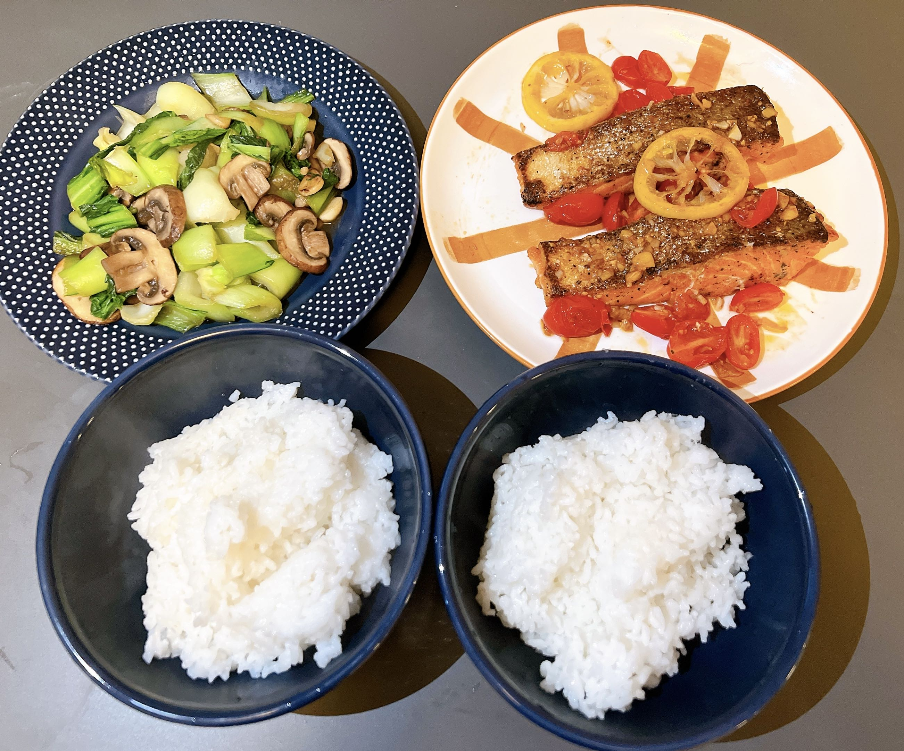
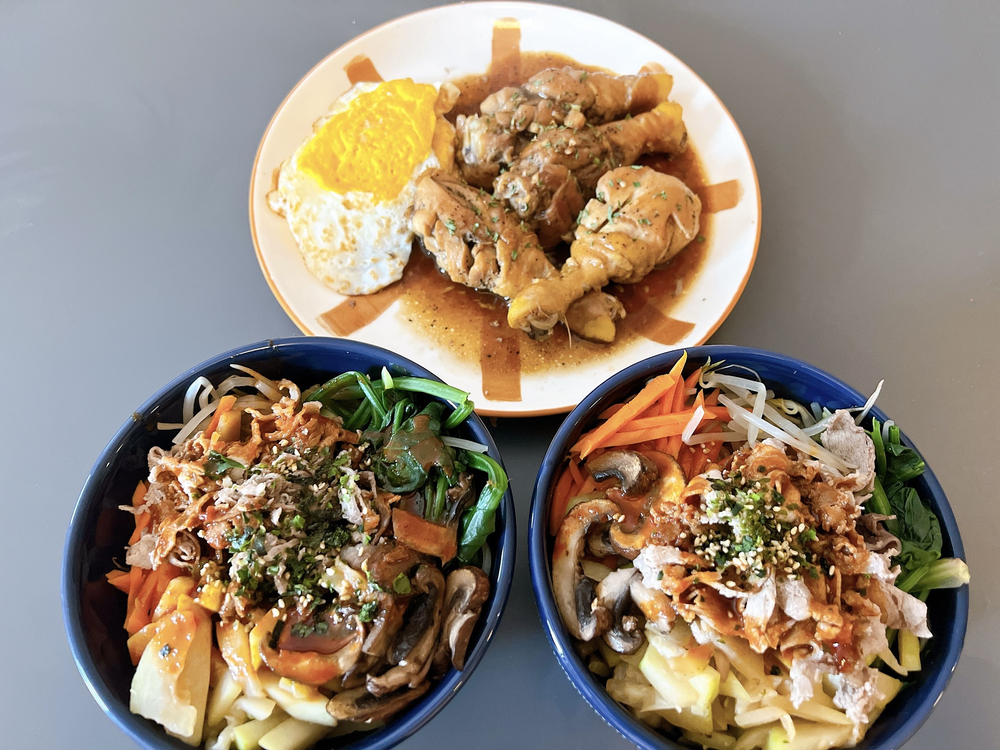

 
 

* [My CV](info/CV_jiayi.pdf)
* [Undergrad Transcript](info/transcript.pdf)

***

### Education

* I am now a Biostatistics MS student at Columbia University Mailman School of Public Health, with expected graduation in May 2024. I received a BS in applied mathematics from University of Nottingham Ningbo China in Jul 2022.

* Relevant courses: Data Science, Biostatistical Methods, Statistics, Probability, Principals of Epidemiology, Mathematical Analysis (Real Analysis), Vector Calculus, Calculus 

### Research

I served as an undergrad research assistant under the supervision of Prof. Pushpendu Kar for two years at the University of Nottingham Ningbo China. During that period, I completed quite a few research projects and published two papers at IEEE, one is about predicting the spread of Covid-19 ([IWCMC 2021](https://ieeexplore.ieee.org/document/9498988)) and the other is about data cache efficiency in the remote health-monitoring system ([IEEE Transactions on Computers](https://ieeexplore.ieee.org/document/9854159)). My research experience honed my capabilities in mathematical modelling in the field of public health. Besides, I obtained advanced data analysis skills with R and Matlab.

I desire to do further research in biostatistics and have a keen interest in clinical trials. I am enthusiastic to carry out productive research in statistical methods in clinical trials, dose finding and precision medicine. In the future, I want to pursue a PhD degree in biostatistics and to be a biostatistician who can contribute positively to the research going on in these fields.

### Work Experience

* I worked as a Product Data Intern at Ningbo Xiaochen Technology and Information Company. During this time, I cooperated with my team members to develop a WeChat program called “uMap” for campus navigation, which received more than 1300 registrations within one month after its launch. 

* I interned at Ping An Insurance Company of China, Ltd from June to August 2021. My work included automating the report generation process by using SQL and Excel, realizing the automatic push of daily performance reports by emails and taking minutes of weekly meetings.

### Skills

R, Python, Matlab, Microsoft Office 

### Hobbies

Cooking, Reading, Singing, Hiking.

   

***

  

